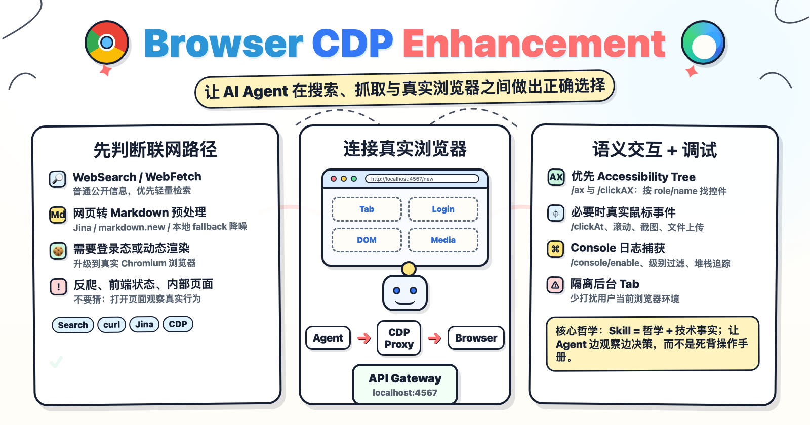

<p align="center">
  
</p>

<p align="center">
  <b>让 AI Agent 在搜索、抓取与真实浏览器之间做出正确选择的增强 Skill。</b><br/>
  <a href="#安装">⚡ 快速安装</a>
</p>

`browser-cdp-enhancement` 不是单纯的浏览器自动化脚本，而是一套面向 AI Agent 的联网工作流：先判断任务该用搜索、WebFetch/curl、Jina，还是升级到真实 Chromium 浏览器；进入浏览器后，通过本地 CDP Proxy 使用用户已有登录态，在独立后台 tab 中完成动态页面读取、交互操作、Console 排错、媒体/视频内容提取，并在需要时复用站点经验与本地书签/历史。

它适合处理普通网页调研，也适合处理静态抓取失效、需要登录态、需要真实用户界面、或目标来自用户浏览器历史/内部系统的任务。核心目标是让 Agent 像熟练的人类浏览器用户一样边观察边决策，同时尽量减少对用户当前浏览器环境的打扰。

---

## 能力

| 能力 | 说明 |
|------|------|
| 联网路径决策 | 在 WebSearch / WebFetch / curl / Jina / CDP 之间按任务目标、登录态、反爬和信息来源质量自主选择 |
| CDP Proxy 浏览器操作 | 直连用户日常 Chromium 浏览器，使用已有登录态，在 Agent 自建后台 tab 中处理动态页面与交互任务 |
| 多浏览器支持 | Chrome、Brave、Vivaldi、Edge，首次检测并引导选择，后续按保存配置自动启动和连接 |
| Console 日志捕获 | `/console/enable` 开启，`/console` 读取，支持级别过滤和堆栈追踪 |
| 语义化控件定位 | `/ax` 查询 Accessibility Tree，`/clickAX` 按 role/name 真实点击，优先于脆弱的 CSS selector |
| 交互与上传 | `/click`（JS click）、`/clickAt`（CDP 真实鼠标事件）、`/setFiles`（文件上传） |
| 本地浏览器书签/历史检索 | `find-url.mjs` 查询公网搜不到的目标或用户访问过的页面 |
| 并行分治 | 多个独立目标可分发子 Agent 并行执行，共享一个 Proxy，并通过不同 tab 隔离 |
| 站点经验积累 | 按域名存储操作经验（URL 模式、平台特征、已知陷阱），跨 session 复用 |
| 媒体与视频分析 | 从 DOM 直取图片/视频 URL，或控制 `<video>` seek 后截取指定时间点画面 |

## 安装

**方式一：让 Agent 自动安装**

```
帮我安装这个 skill：https://github.com/weekitmo/browser-cdp-enhancement
```

**方式二：手动**

```bash
git clone https://github.com/weekitmo/browser-cdp-enhancement ~/.claude/skills/browser-cdp-enhancement
```

**方式三：npx**

```bash
npx -y skills add https://github.com/weekitmo/browser-cdp-enhancement -g -y -a universal
```

## 前置配置（CDP 模式）

CDP 模式需要 **Node.js 22+** 和支持远程调试的浏览器。

首次使用时，Agent 会自动检测已安装的浏览器并引导你选择：

```bash
# 检测已安装浏览器
node scripts/check-deps.mjs --detect

# 直接启动指定浏览器（自动带 --remote-debugging-port，无需手动点弹窗）
node scripts/check-deps.mjs --launch "Brave Browser"
```

选择会保存到 `.cdp-browser.json`，后续使用自动启动，无需再次选择。

**永久免弹窗启动（可选）：**

```bash
# macOS
open -a "Brave Browser" --args --remote-debugging-port=9222 --remote-allow-origins=*
open -a "Google Chrome" --args --remote-debugging-port=9222 --remote-allow-origins=*
open -a Vivaldi --args --remote-debugging-port=9222 --remote-allow-origins=*
```

## CDP Proxy API

Proxy 通过 WebSocket 直连浏览器，提供 HTTP API：

```bash
# 页面操作
curl -s "http://localhost:4567/new?url=https://example.com"              # 新建 tab
curl -s -X POST "http://localhost:4567/eval?target=ID" -d 'document.title'  # 执行 JS
curl -s -X POST "http://localhost:4567/click?target=ID" -d 'button.submit'  # JS 点击
curl -s -X POST "http://localhost:4567/clickAt?target=ID" -d '.upload-btn'  # 真实鼠标点击
curl -s "http://localhost:4567/screenshot?target=ID&file=/tmp/shot.png"     # 截图
curl -s "http://localhost:4567/scroll?target=ID&direction=bottom"           # 滚动
curl -s "http://localhost:4567/close?target=ID"                             # 关闭 tab
curl -s "http://localhost:4567/health"                                      # 查看状态

# Console 日志
curl -s "http://localhost:4567/console/enable?target=ID"                    # 开启日志捕获
curl -s "http://localhost:4567/console?target=ID"                           # 获取全部日志
curl -s "http://localhost:4567/console?target=ID&level=error"               # 只看 error
curl -s "http://localhost:4567/console?target=ID&level=error,warn&limit=20" # error+warn 最多20条
curl -s "http://localhost:4567/console/clear?target=ID"                     # 清空日志
```

Proxy 会自动追踪通过 `/new` 创建的 tab，闲置 15 分钟后自动关闭。可通过环境变量 `CDP_TAB_IDLE_TIMEOUT`（单位毫秒）调整超时时间。

## 使用前提醒

通过浏览器自动化操作社交平台存在账号被平台限流或封禁的风险。**强烈建议使用小号进行操作。**

## 使用

安装后直接让 Agent 执行联网任务，skill 自动接管：

- "帮我搜索 xxx 最新进展"
- "读一下这个页面：[URL]"
- "去小红书搜索 xxx 的账号"
- "帮我在创作者平台发一篇图文"
- "同时调研这 5 个产品的官网，给我对比摘要"

## 设计哲学

> Skill = 哲学 + 技术事实，不是操作手册。讲清 tradeoff 让 AI 自己选，不替它推理。

详见 [SKILL.md](./SKILL.md) 中的浏览哲学部分。

## License

MIT · 作者：weekitmo
